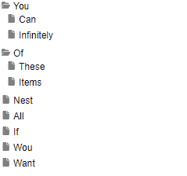

# React Tree DnD

Simple react tree with Drag and Drop.



_Read me_ to be updated...

### To do

- Optimize further the performance for trees with many nodes

###

- **[2.0.0]** Add touch support
- **[2.0.0]** Add custom placeholder support through a new _placeholderRenderer_ prop

# Use case

## Tree

```javascript
const { tree, setTree } = useTreeDnD({
  id: "1",
  children: [
    {
      id: "123",
      title: "You",
      directory: true,
      expanded: false,
      children: [
        { id: "2", title: "Can" },
        { id: "3", title: "Infinitely" },
      ],
    },
    { id: "4", title: "Nest" },
    { id: "5", title: "All" },
    {
      id: "6",
      title: "Of",
      directory: true,
      expanded: true,
      children: [
        { id: "10", title: "These" },
        { id: "11", title: "Items" },
      ],
    },
    { id: "7", title: "If" },
    { id: "8", title: "Wou" },
    { id: "9", title: "Want" },
  ],
});

const onChange = (treeChildren: TreeNode[]) => {
  setTree((old) => ({ ...old, children: treeChildren }));
};
return (
  <div style={{ width: 200 }}>
    <TreeDnD
      tree={tree}
      onChange={onChange}
      renderer={Node}
      dropLineRenderer={DropLine}
    />
  </div>
);
```

## Node Renderer

```typescript
const Node: React.FC<TreeNode> = (node) => {
  const expandRef = useRef<HTMLDivElement>(null);

  const [state] = useTreeDnDState();
  const directoryHovered =
    state.hovered?.nodeId === node.id && state.hovered.position === "inside";

  const icon_size = 12;

  const NodeIcon = !node.directory
    ? IconFile
    : node.expanded
    ? IconFolderOpen
    : IconFolder;

  return (
    <TreeNodeDraggable
      node={node}
      expandRef={node.directory ? expandRef : undefined}
    >
      <div
        style={{
          fontSize: 12,
          fontFamily: "arial",
          padding: 2,
          border: "2px solid " + (directoryHovered ? "orange" : "transparent"),
        }}
        ref={expandRef}
      >
        <div>
          <span style={{ paddingRight: 4 }}>
            <NodeIcon width={icon_size} height={icon_size} />
          </span>
          {node.title}
        </div>
        {node.directory && node.expanded ? (
          <div style={{ marginLeft: 10 }}>
            {node.children.map((childNode) => (
              <Node key={childNode.id} {...childNode} />
            ))}
          </div>
        ) : null}
      </div>
    </TreeNodeDraggable>
  );
};
```

## DropLine Renderer

```typescript
const DropLine: React.FC<DropLineRendererInjectedProps> = (props) => {
  return (
    <div
      style={{
        height: 2,
        background: "orange",
        ...props.injectedStyles,
      }}
    ></div>
  );
};
```
