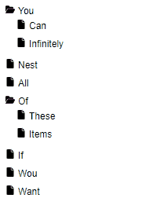

# React Tree DnD
Simple react tree with Drag and Drop.



*Read me* to be updated... Below a use case and relevant types

Does not support touch events (yet)
# Use case

```javascript
function App() {
  const { tree, setTree } = useDndTree({
    id: "1",
    children: [
      { id: "4", title: "Nest" },
      { id: "1", title: "You", directory: true, expanded: true, children: [
          { id: "2", title: "Can" },
          { id: "1", title: "You", directory: true, expanded: true, children: [
              { id: "2", title: "Can" },
              { id: "3", title: "Infinitely" },
            ],
          },
        ],
      },
      { id: "5", title: "All" },
      { id: "9", title: "Want" },
    ],
  });

  const onChange = (treeChildren: TreeNode[]) => {
    setTree((old) => ({ ...old, children: treeChildren }));
  };

  
  return (
      <DnDSortableTree
        tree={tree}
        onChange={onChange}
        renderer={(id) => (
          <TreeNodeRendererDefault
            key={id}
            nodeId={id}
            color="black"
            iconColor="grey"
          />
        )}
      />
  );
}
```
  
# Relevant types
                      
```ts
interface TreeIdentifier {
  id: string;
  children: TreeNode[];
}
interface TreeNodeBase {
  id: string;
  title: string;
  directory: false;
  data?: any;
}
interface TreeNodeDirectory extends TreeNodeBase {
  directory: true;
  expanded: boolean;
  children: TreeNode[];
}
interface DnDSortableTreeProps extends Partial<TreeEvents> {
  tree: TreeIdentifier;
  renderer?: NodeRenderer;
}
interface TreeEvents {
  onChange: (treeChildren: TreeNode[]) => void;
  onClick: (node: TreeNode) => void;
  onExpandedToggle: (node: TreeNode, expanded: boolean) => void;
  onDragStateChange: (dragging: boolean, node?: TreeNode) => void;
  onDropPositionChange: (target: NodeHovered | null) => void;
}
type NodeHovered = { nodeId: string; position: DropPosition | null };
```
